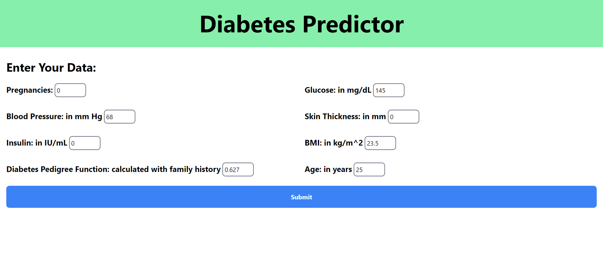

# Diabetes Predictor

This is a diabetes predictor that uses a machine learning model to predict whether a person has diabetes or not based on their health metrics.

The health metrics collection is not advanced and has to be done manually by the user. The user has to enter the following metrics:

- Pregnancies
- Glucose
- Blood Pressure
- Skin Thickness
- Insulin
- BMI
- Diabetes Pedigree Function
- Age

The order and formatting is taken care by the application. The user just has to enter the values.

The application uses a machine learning model to predict whether the user has diabetes or not. The model is trained on the [Pima Indians Diabetes Database](https://www.kaggle.com/uciml/pima-indians-diabetes-database) dataset.

The model uses all three algorithms: Logistic Regression, Random Forest Classifier and Neural Networks. The model with the highest accuracy is used to make the prediction.

The application is built using [flask](https://flask.palletsprojects.com/)

## How to run

To, run, you first need to know the file structure. The file structure is as follows:

```
./
├── client
│   ├── app.py
│   ├── service
├── model
│   ├── model.pkl
|   ├── model.ipynb
|   ├── diabetes.csv
├── README.md
```

Now, the model.pkl is already pre trained to have a good enough accuracy. If you want to train the model yourself, you can use the model.ipynb file and output to `model.pkl`. The application will automatically use the new model.
However, before that, you need to install the dependencies. You can do that by running `pip install -r requirements.txt` in the terminal.

Now, to run the application, you need to go in the client folder. You can do that by running `cd client` in the terminal.

Now, you need to install the dependencies. You can do that by running `pip install -r requirements.txt` in the terminal.

Then, run the application by running `python app.py` in the terminal.

```shell
cd client
pip install -r requirements.txt
python app.py
```

## Model training

I documented the whole of the model training process in the model.ipynb file. You can check it out if you want to know how the model was trained.


## How to use

Once you run the application, you will see a screen like this:



Now, you need to enter the values in the text boxes. The order is the same as mentioned above. Once you enter the values, click on the `Submit` button.

That's it! You will see the result on the screen.

## How to contribute

If you want to contribute, you can fork the repository and make a pull request. If you find any bugs, you can open an issue.

## License

This project is licensed under the MIT License. You can read more about it in the [LICENSE](LICENSE) file.
